# Activity Diagram TBScan

Berikut adalah Activity Diagram yang menggambarkan alur proses pada aplikasi **TBScan**, mulai dari pengguna membuka aplikasi hingga hasil diagnosis (termasuk Grad-CAM heatmap) ditampilkan dan disimpan. Diagram ini sudah disesuaikan dengan pendekatan **Online Inference (API-based)** dan *confidence threshold* **70%**.

```mermaid
flowchart TD
    %% Define Styles
    classDef mobile fill:#e3f2fd,stroke:#1565c0,stroke-width:2px;
    classDef backend fill:#f3e5f5,stroke:#7b1fa2,stroke-width:2px;
    classDef storage fill:#fff3e0,stroke:#e65100,stroke-width:2px;
    classDef decision fill:#fff9c4,stroke:#fbc02d,stroke-width:2px;

    %% Flow
    Start([Mulai Aplikasi]) --> CheckAuth{Sudah Login?}
    
    %% Auth Flow
    CheckAuth -- Belum --> Login[Login via Firebase Auth]
    Login --> Dashboard
    CheckAuth -- Sudah --> Dashboard[Tampil Dashboard]
    
    %% Patient Selection
    Dashboard --> SelectPatient[Pilih / Buat Data Pasien Baru]
    SelectPatient --> InputXray[Upload Foto X-Ray<br/>Kamera / Galeri]
    
    %% Validation
    InputXray --> ValidateFile{Validasi Format<br/>& Ukuran?}
    ValidateFile -- Tidak Valid --> ErrorMsg[Tampil Pesan Error]
    ErrorMsg --> InputXray
    
    %% API Request
    ValidateFile -- Valid --> Preview[Preview Gambar X-Ray]
    Preview --> HitAPI[Tekan 'Analisis'<br/>POST /predict]
    
    %% Backend Processing Subgraph
    subgraph Backend [Backend API & AI Engine]
        direction TB
        HitAPI --> Preprocess[Preprocessing<br/>Resize 224x224 & Normalize]
        Preprocess --> Inference[Inference Model MobileNetV2]
        Inference --> GradCam[Generate Grad-CAM Heatmap]
        GradCam --> CheckConfidence{Confidence<br/>>= 70%?}
        
        CheckConfidence -- Ya --> LabelPos[Label: TB POSITIF]
        CheckConfidence -- Tidak --> LabelNeg[Label: NORMAL]
        
        LabelPos --> ReturnResponse[Return JSON Response<br/>Label, Confidence, Heatmap]
        LabelNeg --> ReturnResponse
    end
    
    %% Result & Storage
    ReturnResponse --> ShowResult[Tampil Hasil & Rekomendasi<br/>di Layar Smartphone]
    ShowResult --> SaveData[Auto-save Hasil & Heatmap<br/>ke Firestore & Storage]
    
    %% Export / End
    SaveData --> AskExport{Export PDF?}
    AskExport -- Ya --> ExportPDF[Generate Laporan PDF]
    AskExport -- Tidak --> End([Selesai])
    ExportPDF --> End

    %% Apply Classes
    class Start,Login,Dashboard,SelectPatient,InputXray,ErrorMsg,Preview,HitAPI,ShowResult,ExportPDF,End mobile;
    class Preprocess,Inference,GradCam,LabelPos,LabelNeg,ReturnResponse backend;
    class SaveData storage;
    class CheckAuth,ValidateFile,CheckConfidence,AskExport decision;
```

### Keterangan Warna:
- 🟦 **Biru**: Proses yang berjalan di sisi *Mobile App* (Flutter).
- 🟪 **Ungu**: Proses komputasi yang berjalan di *Backend API & AI Engine*.
- 🟧 **Oranye**: Proses penyimpanan ke *Database / Storage* (Firebase).
- 🟨 **Kuning**: *Decision point* (Pengecekan / Validasi).
